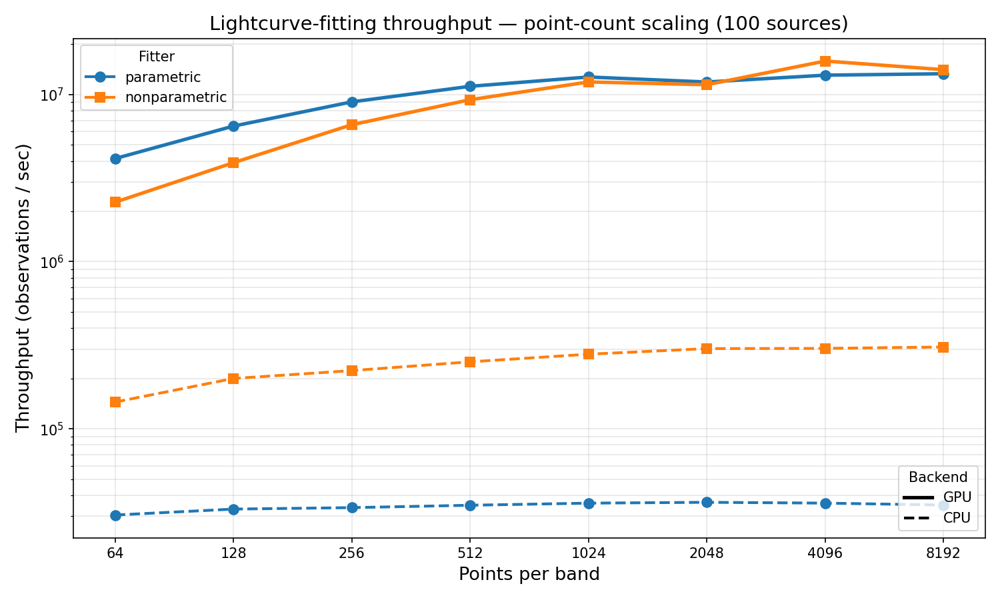

# Benchmarks

## Methodology

All benchmarks use synthetic Bazin-model light curves with realistic noise
in three bands (g, r, i), matching the typical ZTF photometry format.
Each run fits **100 light curves** simultaneously.

- **CPU**: Rust sequential processing (single-threaded)
- **GPU**: CUDA batch processing across all sources simultaneously
- **Hardware**: NVIDIA Tesla P100 (12 GB), Skylake Xeon
- **Timing**: best of 3 runs after 1 warmup iteration
- **Metric**: throughput in total observations processed per second
  (`n_sources * n_points_per_band * 3_bands / wall_sec`)

### Fitters benchmarked

| Fitter | Description |
|--------|-------------|
| **parametric** | PSO model selection (8 models, 20 particles) + Laplace uncertainty |
| **nonparametric** | Gaussian-process interpolation + feature extraction |

### GP strategy

The nonparametric fitter uses a hybrid GP approach for scalability:

- **n <= 100 observations**: Custom DenseGP on all data. O(n^3).
- **n > 100 observations**: Sparse FITC approximation with 30 inducing points. O(n*m^2) — linear in observation count.

Both implementations use hand-rolled inline RBF kernels and row-major Cholesky.

## Point-Count Scaling (100 sources)



### Throughput table (observations/sec)

| pts/band | NP CPU | NP GPU | Param CPU | Param GPU |
|---------:|-------:|-------:|----------:|----------:|
| 64 | 144K | 2.3M | 30K | 4.1M |
| 128 | 200K | 3.9M | 33K | 6.5M |
| 256 | 223K | 6.6M | 34K | 9.0M |
| 512 | 251K | 9.3M | 35K | 11.2M |
| 1,024 | 279K | 11.9M | 36K | 12.7M |
| 2,048 | 302K | 11.4M | 36K | 11.9M |
| 4,096 | 303K | 15.9M | 36K | 13.1M |
| 8,192 | 308K | 14.1M | 35K | 13.3M |

### Source-count scaling

Source-count scaling is approximately flat for both fitters: parametric CPU
runs at ~11K obs/sec and nonparametric CPU at ~50-69K obs/sec regardless
of source count (10-1000 sources at 30 pts/band).

### Discussion

**GPU acceleration**: Both fitters achieve 12-16M obs/sec on GPU at high
point counts — up to **400x faster than parametric CPU** and **50x faster
than nonparametric CPU**. The GPU implementations batch all sources into a
single kernel launch, amortizing launch overhead.

**Parametric GPU vs nonparametric GPU**: At low point counts (64 pts/band),
parametric GPU is ~2x faster than nonparametric GPU because the PSO
particle evaluations (20 particles x 50 iterations x 8 models = 8,000
work items per source) provide massive thread-level parallelism.
The nonparametric fit kernel launches one block per band (300 blocks for
100 sources x 3 bands), with threads parallelizing across hyperparameter
combos. At high point counts (4096+), nonparametric GPU overtakes
parametric as the prediction kernel (one thread per observation) fully
saturates the GPU.

**CPU comparison**: Nonparametric CPU is 5-9x faster than parametric CPU.
Both plateau above ~1024 pts/band as their respective fixed costs dominate
(sparse GP fit for nonparametric, PSO iterations for parametric).

**LSST DDF implications**: At 8,192 pts/band (representative of a
well-sampled DDF source), GPU processing reaches 14M obs/sec — fitting
100 sources with ~2.5M total observations in under 0.2 seconds.

## Reproducing

```bash
# Run all benchmarks (requires CUDA for GPU columns)
cargo test --release --features cuda --test bench_throughput -- --ignored --nocapture

# Individual suites
cargo test --release --features cuda --test bench_throughput nonparametric_point_scaling -- --ignored --nocapture
cargo test --release --features cuda --test bench_throughput parametric_point_scaling -- --ignored --nocapture

# CPU-only
cargo test --release --test bench_throughput -- --ignored --nocapture

# Generate plot from CSVs
python3 benchmarks/plot_throughput.py
```

Results are written to `benchmarks/nonparametric_points.csv` and
`benchmarks/parametric_points.csv`.
