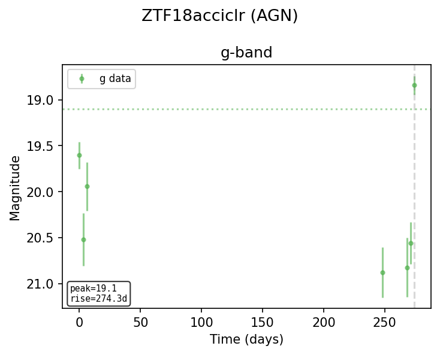
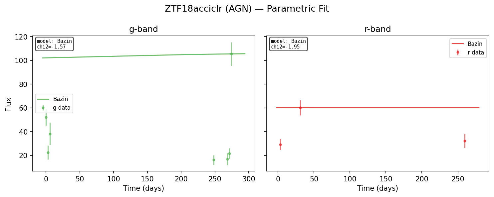

# AGN Example

Active Galactic Nuclei (AGN) exhibit stochastic variability driven by
accretion-disk instabilities rather than a single-peaked transient event. Their
lightcurves lack the clear rise-peak-decay morphology of supernovae or TDEs,
instead showing irregular, ongoing fluctuations over long timescales.

## Loading photometry

```python
import lightcurve_fitting as lcf

# Example AGN-like photometry (stochastic variability, no clear peak)
bands = lcf.BandDataMap.from_dict({
    "g": ([0, 10, 25, 40, 60, 85, 110, 140, 175, 210, 250, 300],
          [19.8, 19.5, 19.9, 19.3, 19.7, 19.4, 19.8, 19.6, 19.2, 19.7, 19.5, 19.9],
          [0.10, 0.08, 0.11, 0.07, 0.09, 0.08, 0.10, 0.09, 0.07, 0.09, 0.08, 0.11]),
    "r": ([0, 10, 25, 40, 60, 85, 110, 140, 175, 210, 250, 300],
          [19.5, 19.2, 19.6, 19.0, 19.4, 19.1, 19.5, 19.3, 18.9, 19.4, 19.2, 19.6],
          [0.09, 0.07, 0.10, 0.06, 0.08, 0.07, 0.09, 0.08, 0.06, 0.08, 0.07, 0.10]),
})
```

## Nonparametric fit

```python
result = lcf.fit_fast(bands)

np_results = result["nonparametric"]
thermal    = result["thermal"]
```

### Discriminating features for AGN

The key features that distinguish AGN from true transients are related to
stochasticity and timescale rather than peak morphology:

| Feature                  | Typical AGN range | Why                                         |
|--------------------------|-------------------|---------------------------------------------|
| `von_neumann_ratio`      | ~1.5-2.0          | Highest of all classes; stochastic variability |
| `fwhm`                   | Very long          | Longest timescales; no single transient peak |
| `rise_time`              | Very long          | No well-defined rise phase                  |
| `post_peak_monotonicity` | ~0.4-0.6          | Near random; no monotonic decay             |
| `pre_peak_rms`           | High               | Ongoing variability before any "peak"       |

```python
for r in np_results:
    print(f"Band {r['band']}:")
    print(f"  Von Neumann      = {r['von_neumann_ratio']:.3f}")
    print(f"  FWHM             = {r['fwhm']:.1f} days")
    print(f"  Post-peak mono   = {r['post_peak_monotonicity']:.3f}")
    print(f"  Pre-peak RMS     = {r['pre_peak_rms']:.3f}")
```

The class-discriminating tests in `tests/test_real_data.rs` validate that AGN
have the longest timescales (`agn_has_longest_timescales`) -- both FWHM and
rise time exceed all SN types -- and the most stochastic von Neumann ratio
(`agn_most_stochastic_von_neumann`).

### GP features for AGN classification

GP-derived features are the most useful for distinguishing AGN from true
transients. In particular:

- **`gp_peak_to_peak`**: Large for AGN (multiple comparable peaks from
  stochastic variability) vs. small for single-peaked transients.
- **`gp_n_inflections`**: High for AGN (many direction changes) vs. low for
  smooth transients.
- **`gp_skewness`** and **`gp_kurtosis`**: Reflect the shape of the GP
  magnitude distribution, which differs between stochastic and transient
  lightcurves.
- **`gp_post_var_mean`** / **`gp_post_var_max`**: GP posterior variance is
  generally higher for AGN because the stochastic signal is harder to model
  with a single smooth GP.

## Parametric fit

Parametric models designed for transients (Bazin, Villar, TDE, etc.) are
generally a poor fit for AGN lightcurves. The per-model chi2 values will be
uniformly high:

```python
times_flat = [0, 10, 25, 40, 60, 85, 110, 140, 175, 210, 250, 300] * 2
mags_flat  = [19.8, 19.5, 19.9, 19.3, 19.7, 19.4, 19.8, 19.6, 19.2, 19.7, 19.5, 19.9,
              19.5, 19.2, 19.6, 19.0, 19.4, 19.1, 19.5, 19.3, 18.9, 19.4, 19.2, 19.6]
errs_flat  = [0.10, 0.08, 0.11, 0.07, 0.09, 0.08, 0.10, 0.09, 0.07, 0.09, 0.08, 0.11,
              0.09, 0.07, 0.10, 0.06, 0.08, 0.07, 0.09, 0.08, 0.06, 0.08, 0.07, 0.10]
bands_flat = ["g"] * 12 + ["r"] * 12

flux_bands = lcf.build_flux_bands(times_flat, mags_flat, errs_flat, bands_flat)
param_results = lcf.fit_parametric(flux_bands, fit_all_models=True)

for r in param_results:
    print(f"Band {r['band']}: best = {r['model']}, chi2 = {r['pso_chi2']:.4f}")
    for model, chi2 in r["per_model_chi2"].items():
        print(f"  {model}: chi2 = {chi2}")
```



