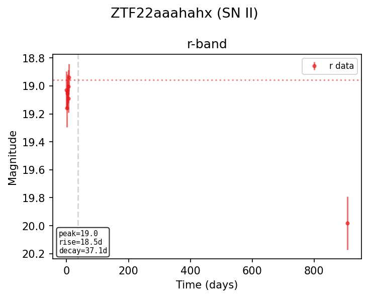
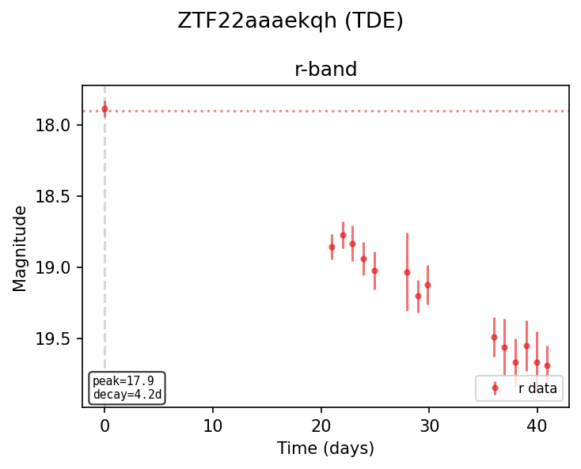
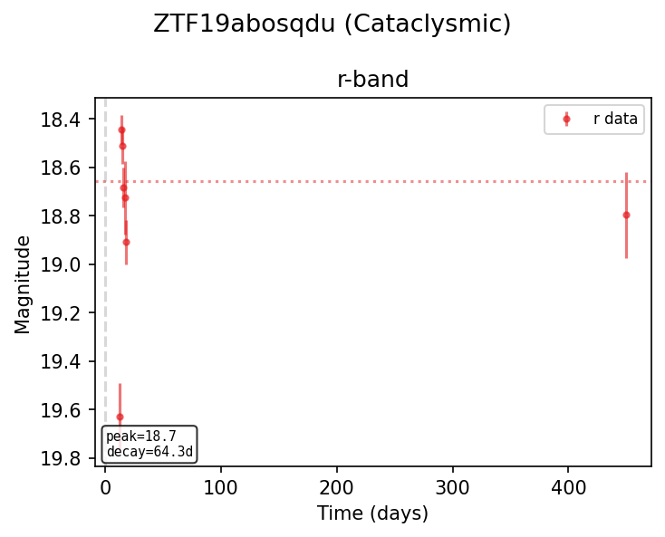

# Nonparametric GP Fitting

## Overview

The nonparametric fitter fits a Gaussian process (GP) to each photometric band
independently, then extracts 30+ time-domain features from the GP posterior
mean.  It requires no physical model assumptions and works on any transient
class.

The entry point is `fit_nonparametric`, which returns per-band feature structs
(`NonparametricBandResult`) and a map of trained `DenseGP` objects that can be
reused by downstream fitters (e.g. thermal temperature estimation).

## GP Strategy

Two GP implementations are selected automatically based on the number of
observations in a band:

| Regime | Implementation | Complexity | Details |
|--------|---------------|------------|---------|
| n <= 100 | **DenseGP** (full Cholesky) | O(n^3) | Exact posterior, RBF kernel, row-major Cholesky with no BLAS dependency |
| n > 100 | **SparseGP** (FITC approximation) | O(n * m^2) | m = 30 uniformly-spaced inducing points, approximate posterior |

Both use a 1D RBF (squared-exponential) kernel with two hyperparameters:
amplitude and lengthscale.

When the sparse path is taken, a separate DenseGP is also fit on a subsampled
version of the data (default 25 points, uniform striding) so that downstream
consumers like `fit_thermal` always have a DenseGP available for point
predictions.

## Hyperparameter Search

Hyperparameters are selected via grid search over:

- **Amplitude candidates:** `[0.1, 0.3]`
- **Lengthscale candidates:** `duration / f` for `f` in `[6.0, 12.0, 24.0]`,
  clamped to a minimum of `max(2 * median_dt, 0.1)` where `median_dt` is the
  median time gap between consecutive observations.

**Selection criterion:**

- DenseGP: lowest train RMS (predictions vs. targets at training points).
- SparseGP: lowest approximate negative log marginal likelihood (NLML).

GP predictions are evaluated on a uniform grid of 50 time points spanning the
full observation window.

## Feature List

The `NonparametricBandResult` struct contains the following features for each
band:

### Core light-curve shape

| Feature | Description |
|---------|-------------|
| `peak_mag` | Peak (minimum) magnitude from the GP prediction grid |
| `t0` | Time of peak brightness |
| `rise_time` | Time from first observation to peak |
| `decay_time` | Time from peak to last observation |
| `fwhm` | Full width at half maximum of the light curve |
| `rise_rate` | Rate of brightening (mag/day) |
| `decay_rate` | Rate of fading (mag/day) |

### Derivative and extrapolation features

| Feature | Description |
|---------|-------------|
| `gp_dfdt_now` | First derivative at the last observation time |
| `gp_dfdt_next` | First derivative one day after the last observation |
| `gp_d2fdt2_now` | Second derivative at the last observation time |
| `gp_predicted_mag_1d` | GP-predicted magnitude 1 day after last observation |
| `gp_predicted_mag_2d` | GP-predicted magnitude 2 days after last observation |
| `gp_time_to_peak` | Time offset from last observation to GP peak |
| `gp_extrap_slope` | Slope of GP extrapolation 2-3 days after last observation |

### Variability and signal features

| Feature | Description |
|---------|-------------|
| `gp_sigma_f` | Standard deviation of GP predictions (variability strength) |
| `gp_peak_to_peak` | Max minus min of GP predictions |
| `gp_snr_max` | Maximum signal-to-noise ratio across observations |
| `gp_dfdt_max` | Maximum first derivative on the prediction grid |
| `gp_dfdt_min` | Minimum first derivative on the prediction grid |
| `gp_frac_of_peak` | Ratio of last predicted magnitude to peak magnitude |

### Uncertainty features

| Feature | Description |
|---------|-------------|
| `gp_post_var_mean` | Mean GP posterior variance on the prediction grid |
| `gp_post_var_max` | Maximum GP posterior variance on the prediction grid |

### Statistical shape features

| Feature | Description |
|---------|-------------|
| `gp_skewness` | Skewness of the GP prediction curve |
| `gp_kurtosis` | Excess kurtosis of the GP prediction curve |
| `gp_n_inflections` | Number of inflection points (sign changes in second derivative) |

### Decay characterization

| Feature | Description |
|---------|-------------|
| `decay_power_law_index` | Slope B of `mag = A + B * log10(t - t_peak)` fit to post-peak data. TDEs yield B ~ 4.2 (flux proportional to t^{-5/3}); SNe Ia produce poor fits. |
| `decay_power_law_chi2` | Reduced chi2 of the power-law decay fit (lower = better power-law match) |
| `mag_at_30d` | GP-predicted magnitude at peak + 30 days |
| `mag_at_60d` | GP-predicted magnitude at peak + 60 days |
| `mag_at_90d` | GP-predicted magnitude at peak + 90 days |

### TDE vs AGN discrimination features

| Feature | Description |
|---------|-------------|
| `von_neumann_ratio` | Von Neumann ratio of raw magnitudes. Low (~0.1-0.5) for smooth monotonic evolution (TDE), high (~1.5-2.0) for stochastic variability (AGN). |
| `pre_peak_rms` | Standard deviation of raw magnitudes before GP peak time. Low for TDEs (quiescent baseline), higher for AGN. |
| `rise_amplitude_over_noise` | Rise significance: (pre-peak mean mag - peak mag) / median error. Large for TDEs (clear rise from quiescence), smaller for AGN. |
| `post_peak_monotonicity` | Fraction of consecutive post-peak GP predictions where magnitude increases (fading). ~1.0 for TDEs (monotonic decay), ~0.5 for stochastic AGN. |

### Fit quality

| Feature | Description |
|---------|-------------|
| `chi2` | Reduced chi2 of GP fit vs. observations |
| `baseline_chi2` | Reduced chi2 of a constant (mean magnitude) model |
| `n_obs` | Number of observations in the band |

## Example Images








## Python Usage

```python
import lightcurve_fitting as lcf

# Build per-band data from flat arrays
bands = lcf.build_mag_bands(
    times=[0.0, 1.0, 2.0, 5.0, 10.0, 15.0, 20.0],
    mags=[20.1, 19.5, 18.9, 19.2, 19.8, 20.3, 20.7],
    mag_errs=[0.05, 0.04, 0.03, 0.04, 0.05, 0.06, 0.07],
    bands=["g", "g", "g", "g", "g", "g", "g"],
)

# Or construct from a dict of (times, values, errors) per band
bands = lcf.BandDataMap.from_dict({
    "g": ([0, 1, 2, 5, 10, 15, 20],
          [20.1, 19.5, 18.9, 19.2, 19.8, 20.3, 20.7],
          [0.05, 0.04, 0.03, 0.04, 0.05, 0.06, 0.07]),
    "r": ([0, 1, 2, 5, 10, 15, 20],
          [19.8, 19.2, 18.7, 19.0, 19.5, 20.0, 20.4],
          [0.05, 0.04, 0.03, 0.04, 0.05, 0.06, 0.07]),
})

# Fit nonparametric GP models
results = lcf.fit_nonparametric(bands)

# results is a list of dicts, one per band
for band_result in results:
    print(f"Band: {band_result['band']}")
    print(f"  Peak mag: {band_result['peak_mag']}")
    print(f"  Rise time: {band_result['rise_time']}")
    print(f"  FWHM: {band_result['fwhm']}")
    print(f"  Von Neumann ratio: {band_result['von_neumann_ratio']}")
    print(f"  Decay power-law index: {band_result['decay_power_law_index']}")

# Combined nonparametric + thermal (reuses GP internally)
combined = lcf.fit_fast(bands)
np_results = combined["nonparametric"]
thermal = combined["thermal"]
```
