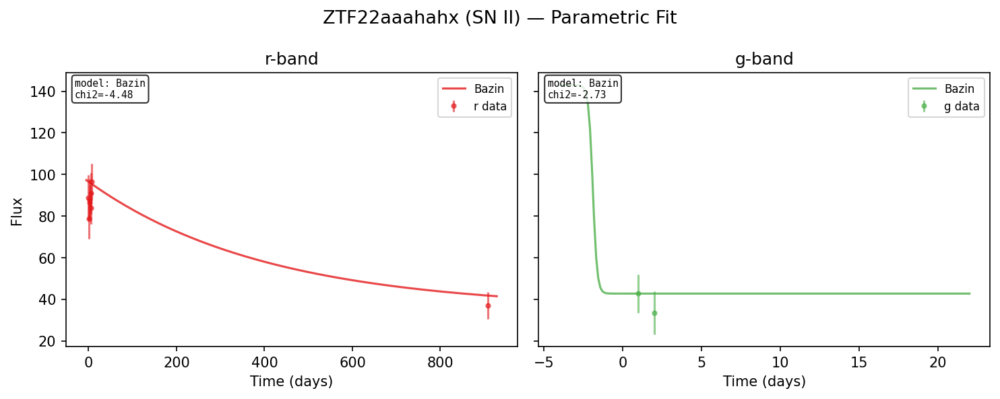
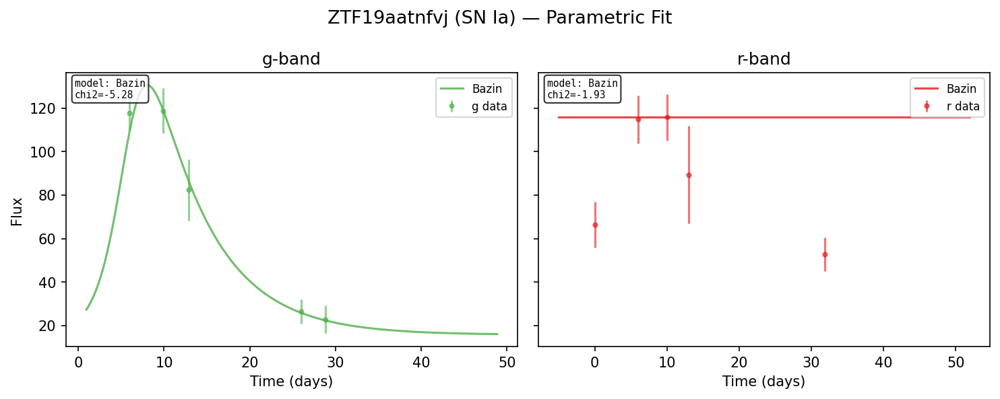
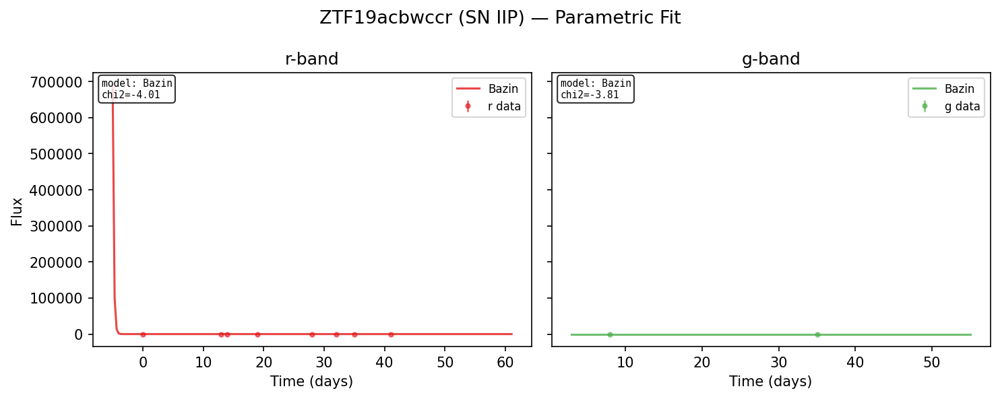
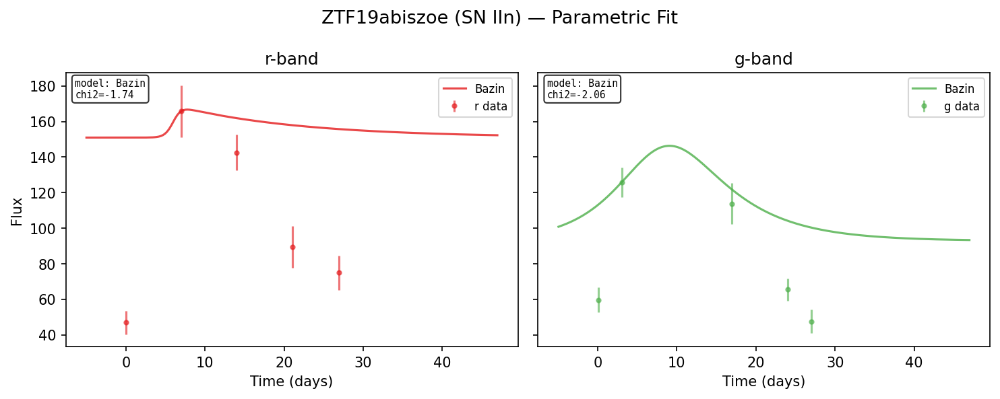
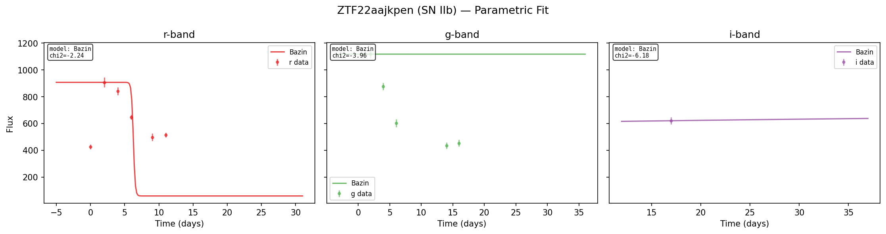
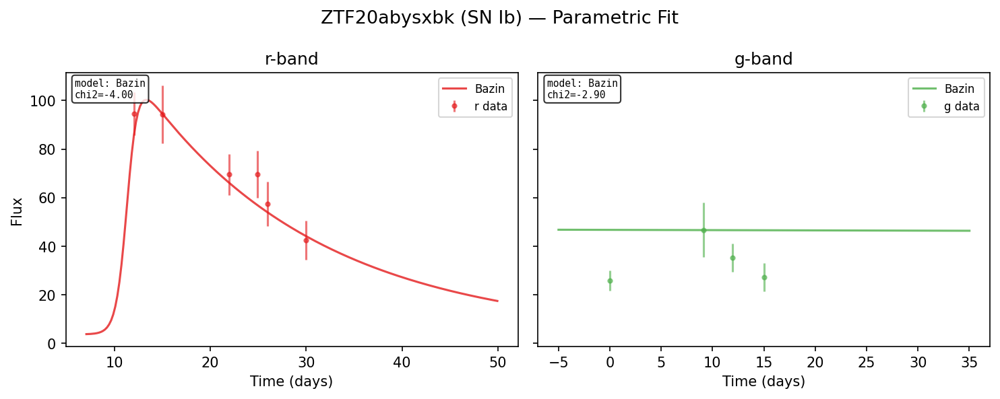
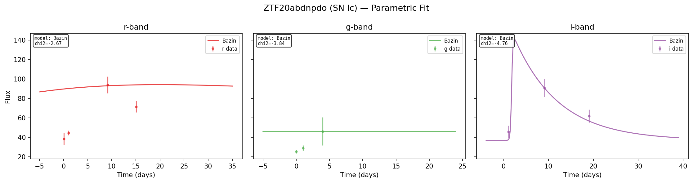
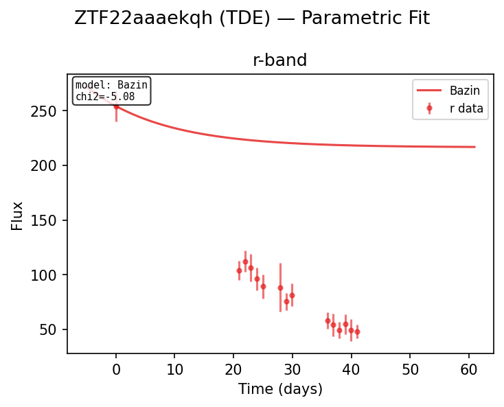
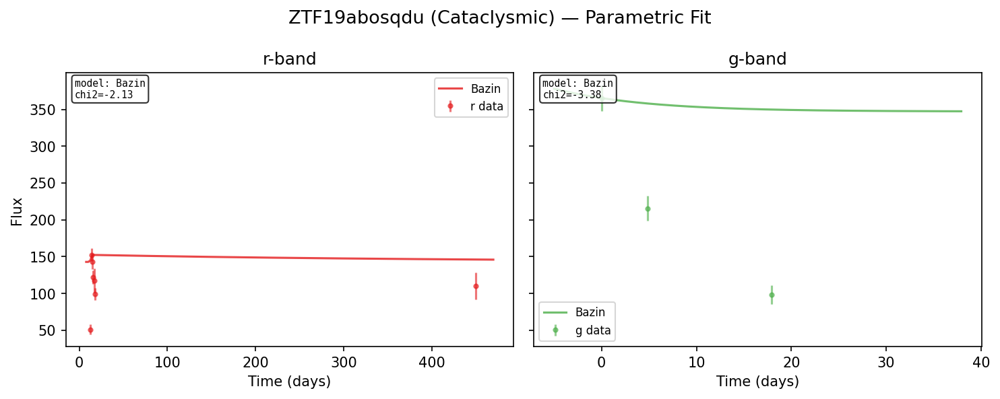

# Parametric Model Selection

## Overview

The parametric fitter fits 8 analytical light curve models to each photometric
band via Particle Swarm Optimization (PSO), selects the best model by chi2,
then estimates parameter uncertainties using either Laplace approximation or
Stochastic Variational Inference (SVI).

The entry point is `fit_parametric`, which returns a `ParametricBandResult` per
band containing the best-fit model name, PSO point estimates, and posterior
uncertainties (mean and log-sigma for each parameter).

## Model Table

| Model | Parameters | Description |
|-------|-----------|-------------|
| **Bazin** | 6 | Empirical rise + exponential decay. Sigmoid rise times exponential fall, plus baseline offset. Widely used for SN Ia light curves. |
| **Villar** | 7 | Bazin + plateau phase. Adds a linear-to-exponential transition at time gamma, suitable for Type IIP supernovae. |
| **TDE** | 7 | Tidal disruption event model. Sigmoid rise with power-law t^{-alpha} decay (canonical alpha ~ 5/3). |
| **Arnett** | 5 | Radioactive nickel-powered supernova (Arnett 1982). Heating from Ni-56 (tau = 8.8 d) and Co-56 (tau = 111.3 d) decay with diffusion trapping. |
| **Magnetar** | 5 | Magnetar spindown-powered supernova. Energy injection from a rapidly spinning magnetar with t^{-2} spindown luminosity and diffusion trapping. |
| **ShockCooling** | 5 | Shock breakout cooling emission. Power-law cooling (t^{-n}) with Gaussian cutoff at the transparency timescale. |
| **Afterglow** | 6 | GRB afterglow power-law model. Smoothly-broken double power-law with indices alpha1 and alpha2, transitioning at break time t_b. |
| **MetzgerKN** | 5 | Kilonova model (Metzger 2017 semi-analytic). One-zone ejecta with r-process heating, neutron-rich composition (Ye = 0.1), solved on a 200-point log-spaced time grid via forward Euler integration. Parameters: log10(M_ej/M_sun), log10(v_ej/c), log10(kappa), t0. |

## PSO Settings

Each model is fit independently using a custom particle swarm optimizer with
the following settings:

| Setting | Value |
|---------|-------|
| Particles | 20 |
| Max iterations | 50 |
| Stall iterations | 10 (early stop if no improvement) |
| Stall tolerance | Relative improvement threshold |
| t0 search | Grid search over 5 coarse + 3 fine t0 candidates |

### Bazin Early-Stop Gate

Bazin is always fit first. If its per-observation negative log-likelihood falls
below the threshold of 2.0 (indicating an acceptable fit), the remaining 7
models are skipped entirely. This avoids spending ~170 ms on exotic models
unlikely to outperform Bazin. When all models are requested
(`fit_all_models=True`), this gate is bypassed.

When the gate is not triggered, the remaining 7 models are fit in parallel
using Rayon, and the model with the lowest chi2 wins.

## Uncertainty Methods

After PSO selects the best model and point estimate, one of two methods
estimates parameter uncertainties:

### Laplace Approximation (method="laplace")

Computes the Hessian of the negative log-posterior at the MAP estimate via
central finite differences, then inverts it to obtain the parameter covariance
matrix.

- **Cost:** 4 function evaluations per unique (i, j) Hessian entry. For a
  model with p parameters, this is `2 * p * (p + 1)` evaluations for the
  off-diagonal and diagonal terms (e.g., 42 evaluations for a 6-parameter
  model).
- Eigendecomposition of the Hessian handles non-positive-definite cases by
  clamping eigenvalues to a minimum of 1e-6.
- Fast but may underestimate uncertainty for multi-modal posteriors.

### Stochastic Variational Inference (method="svi", default)

Fits a mean-field Gaussian variational posterior q(theta) = N(mu, diag(sigma^2))
by maximizing the evidence lower bound (ELBO) via the Adam optimizer.

| Setting | Value |
|---------|-------|
| Max steps | 1000 |
| Monte Carlo samples per step | 4 |
| Learning rate | 0.01 |
| Early stopping | Stalls after 50 iterations of no ELBO improvement (min 200 iterations) |
| Sigma inflation | 4x factor applied to posterior sigmas (conservative) |

SVI is initialized from the PSO point estimate and produces calibrated
uncertainty intervals. It is more expensive than Laplace but better handles
non-Gaussian posteriors.

Both methods are followed by a profile-likelihood refinement of the t0
(explosion time) parameter.

## Example Images




















## Python Usage

```python
import lightcurve_fitting as lcf

# Build per-band flux data from magnitude arrays
bands = lcf.build_flux_bands(
    times=[0.0, 1.0, 2.0, 5.0, 10.0, 15.0, 20.0],
    mags=[20.1, 19.5, 18.9, 19.2, 19.8, 20.3, 20.7],
    mag_errs=[0.05, 0.04, 0.03, 0.04, 0.05, 0.06, 0.07],
    bands=["g", "g", "g", "g", "g", "g", "g"],
)

# Fit with SVI uncertainties (default)
results = lcf.fit_parametric(bands)

# Fit with Laplace uncertainties (faster)
results = lcf.fit_parametric(bands, method="laplace")

# Fit all 8 models (bypass Bazin early-stop gate)
results = lcf.fit_parametric(bands, fit_all_models=True)

# results is a list of dicts, one per band
for band_result in results:
    print(f"Band: {band_result['band']}")
    print(f"  Best model: {band_result['model']}")
    print(f"  PSO chi2: {band_result['pso_chi2']}")
    print(f"  SVI mu: {band_result['svi_mu']}")
    print(f"  SVI log_sigma: {band_result['svi_log_sigma']}")

# Evaluate a fitted model at arbitrary times
import numpy as np
times = np.linspace(0, 30, 100).tolist()
flux = lcf.eval_model(
    model=band_result["model"],
    params=band_result["svi_mu"],
    times=times,
)
```
